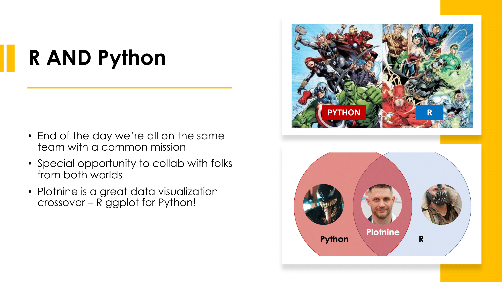

  

# Python Plotnine Workshop
Python Plotnine workshop organized with **R-Ladies** (Cologne, [Paris](https://twitter.com/RLadiesParis)) and **Pyladies** ([Tunis](https://twitter.com/PyLadiesTunis), [Munich](https://twitter.com/pyladiesmunich)). 

**[Plotnine](https://plotnine.readthedocs.io/en/stable/)** is a data visualization package based on R ggplot. In this's workshop, we'll explore how to create and style plots using **plotnine** in Python using. The live workshop was conducted in **[Google Colab](https://colab.research.google.com/)**. 

Workshop materials include a **[starter notebook](https://github.com/tashapiro/python-plotnine-workshop/blob/main/code/plotnine_workshop_starter.ipynb)** for participants who want to code along, and a **[solutions notebook](https://github.com/tashapiro/python-plotnine-workshop/blob/main/code/plotnine_workshop_solutions.ipynb)** with pre-filled code chunks. The workshop covers how to employ different techniques in plotnine with 3 different plot type examples. 

---

## Workshop Intro

Here are the intro [slides](https://github.com/tashapiro/python-plotnine-workshop/blob/main/slides/plotnine-workshop.pdf). Purpose of these slides is to recognize the unique crossover between R & Python and to cover basic ggplot/plotnine concepts.

## Workshop Agenda

This workbook is divided into 5 sections:

1. Set-Up 
2. Data Prep
3. Plot 1: Bar
4. Plot 2: Scatter
5. Plot 3: Density & Facetting

## About The Data

The dataset comes from the **[TidyTuesday](https://github.com/rfordatascience/tidytuesday)** community. The data is sourced from the [**Open-Source Psychometrics Project**](https://openpsychometrics.org/) and contains personality assessments of different characters in pop culture (e.g. characters from Friends, Westworld, Marvel, etc).

## Plots

By the end of the workshop, participants will create a total of 3 different plots.

### Bar Plot

### Scatter Plot

### Density Facet Plot

